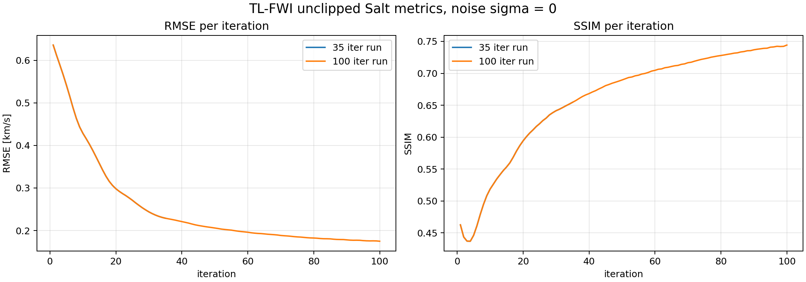
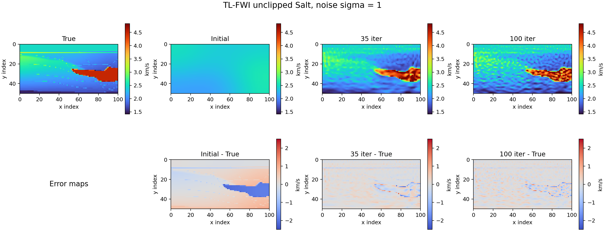
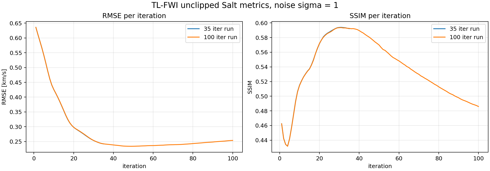

# TL-FWI Unclipped Salt Results: 35 vs 100 Iterations

## Overview

Efficient-style Salt の unclipped dataset に対して、同じ条件で `35` iteration と `100` iteration の TL-FWI-labeled FWI adapter を実行した結果を整理した。

実行コマンド:

```bash
python scripts/run_salt_fwi.py \
  --efficient-dataset-dir data/efficient_salt_unclipped \
  --geometry-mode efficient_reference \
  --noise-mode efficient_reference \
  --noise-sigmas 0,1 \
  --epochs 35  # or 100 \
  --time-steps 791 \
  --lr 0.03 \
  --cost-scaling 0.1 \
  --clip-grad 1e-5
```

`fwi_result.npz` に `velocity_history` が保存されていたため、追加実験なしで各iterationのRMSE/SSIMを後計算した。全iterationの数値はCSVにも保存した。

- Full per-iteration metrics CSV: `tlfwi_unclipped_35_vs_100_iteration_metrics.csv`

## Result Folders

| noise sigma | iterations | folder | files |
|---:|---:|:---|:---|
| 0 | 35 | `comparison/Accelerating_FWI_By_Transfer_Learning/results/20260611_175343_salt_tlfwi_alpha-none_noise-0_box-unclipped` | `fwi_result.npz`, `metrics.csv`, `observed_data.npz` |
| 0 | 100 | `comparison/Accelerating_FWI_By_Transfer_Learning/results/20260611_175728_salt_tlfwi_alpha-none_noise-0_box-unclipped` | `fwi_result.npz`, `metrics.csv`, `observed_data.npz` |
| 1 | 35 | `comparison/Accelerating_FWI_By_Transfer_Learning/results/20260611_175415_salt_tlfwi_alpha-none_noise-1_box-unclipped` | `fwi_result.npz`, `metrics.csv`, `observed_data.npz` |
| 1 | 100 | `comparison/Accelerating_FWI_By_Transfer_Learning/results/20260611_175850_salt_tlfwi_alpha-none_noise-1_box-unclipped` | `fwi_result.npz`, `metrics.csv`, `observed_data.npz` |

## Summary

| noise sigma | iterations | initial RMSE | final RMSE | best RMSE | best RMSE epoch | initial SSIM | final SSIM | best SSIM | best SSIM epoch |
|---:|---:|---:|---:|---:|---:|---:|---:|---:|---:|
| 0 | 35 | 0.664688 | 0.229023 | 0.229023 | 35 | 0.469645 | 0.654577 | 0.654577 | 35 |
| 0 | 100 | 0.664688 | 0.174947 | 0.174947 | 100 | 0.469645 | 0.744266 | 0.744266 | 100 |
| 1 | 35 | 0.664688 | 0.242214 | 0.242214 | 35 | 0.469645 | 0.592189 | 0.593998 | 31 |
| 1 | 100 | 0.664688 | 0.253857 | 0.234073 | 49 | 0.469645 | 0.485934 | 0.593590 | 31 |

## Noise Sigma = 0

### Velocity Models and Error Maps


### RMSE and SSIM Curves



### Per-Iteration RMSE and SSIM

Per-iteration RMSE/SSIMは上のグラフで示す。全iterationの数値は `tlfwi_unclipped_35_vs_100_iteration_metrics.csv` に保存した。


## Noise Sigma = 1

### Velocity Models and Error Maps



### RMSE and SSIM Curves



### Per-Iteration RMSE and SSIM

Per-iteration RMSE/SSIMは上のグラフで示す。全iterationの数値は `tlfwi_unclipped_35_vs_100_iteration_metrics.csv` に保存した。


## Notes

- `epoch=0` はinitial modelを表す。waveform costはFWI更新前なので空欄にした。
- RMSE/SSIMは `velocity_true` と各iterationの `velocity_history` から計算した。
- SSIMの `data_range` はunclipped true velocityの実レンジを用いた。
- 今回は既存結果に全iterationの `velocity_history` が残っていたため、追加のFWI実行は不要だった。
