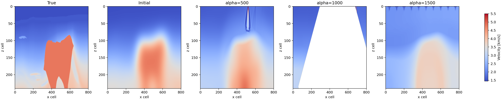
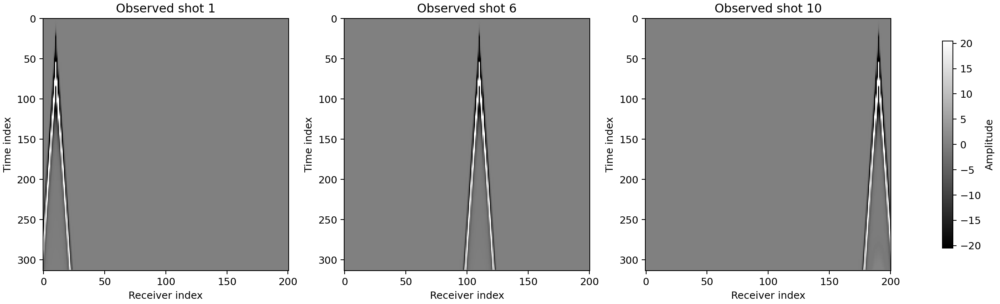
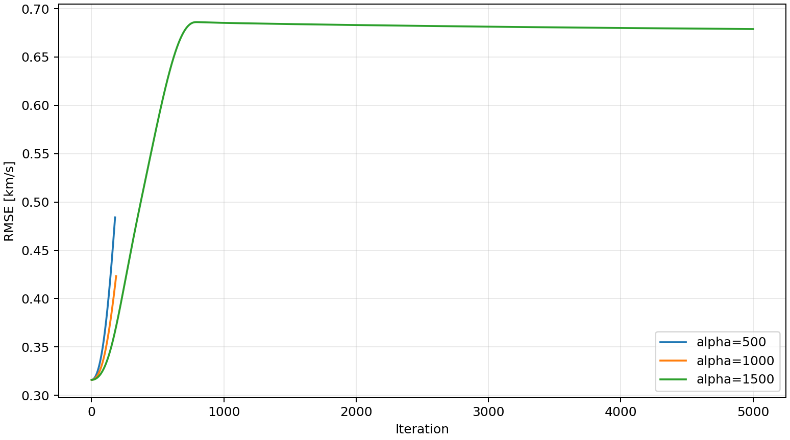
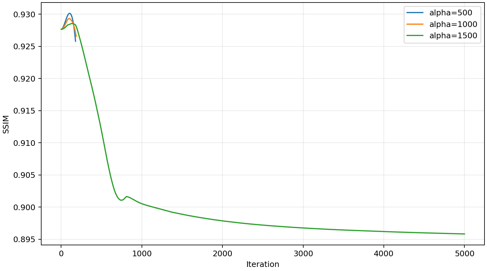
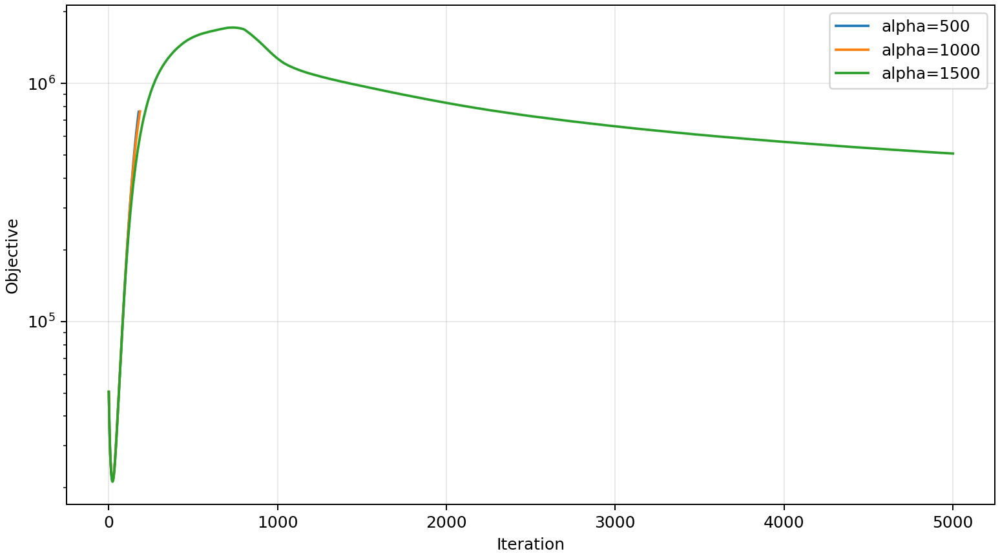
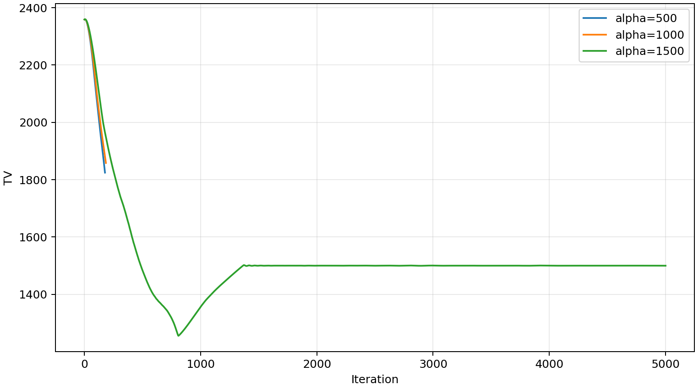

# BP2004 TV + Box Constraint Alpha Sweep Results

## Summary

BP2004 crop に対して TV + box constraint の PDS 版を `alpha=500,1000,1500`、`noise_sigma=0`、`n_shots=10`、`n_receivers=201`、`gamma1=1e-6`、`gamma2=100000` で比較した。速度単位は km/s。

- Model shape: `241 x 801` cells
- Initial RMSE: `0.316009` km/s
- Initial SSIM: `0.927656`
- True TV: `3419.636`
- Initial TV: `2358.151`

## Velocity Models

## Seismic Signal

観測波形 `observed_seismic_data` のshot gather例。今回のnoiseなし条件ではalphaによらず同じ観測データを使うため、代表としてalpha=500 runから描画した。

## RMSE Per Iteration

## SSIM Per Iteration

## Additional Curves

## Final Metrics

| alpha | completed iters | finite final model | final RMSE [km/s] | best RMSE [km/s] | final SSIM | best SSIM | final TV | final objective | elapsed [h] |
|---:|---:|:---:|---:|---:|---:|---:|---:|---:|---:|
| 500 | 179 | yes | 0.484008 | 0.316009 | 0.925793 | 0.930127 | 1824.559 | 760128 | 0.037 |
| 1000 | 187 | no | 0.423333 | 0.316009 | 0.926560 | 0.929330 | 1858.259 | 764389 | 0.039 |
| 1500 | 5000 | yes | 0.678929 | 0.316009 | 0.895819 | 0.928551 | 1499.869 | 507913 | 0.975 |

## Notes

- `metrics.csv` の `mse` は全セルの二乗誤差和なので、`sqrt(mse / number_of_cells)` としてRMSEへ変換した。
- `alpha=500` と `alpha=1000` は5000 iterationには到達しておらず、それぞれ保存済みconfigの `completed_iters` は179, 187だった。`gamma2=100000` でTV制約が強く効き、低alpha条件では早期停止した可能性が高い。
- `alpha=1000` の保存済みfinal modelには非finite値が含まれていた。速度モデル図では該当値をマスクして表示しているため、このrunは失敗扱いで解釈する。
- `alpha=1500` は5000 iterationまで完走しており、この3条件の中では実験として最も安定して比較できる。
- `gamma2=100` の過去runではTV制約の効きが遅すぎたが、`gamma2=100000` ではPDSのTV側更新が明確に強くなる。

## Run Directories

- alpha=500: `results/bp2004/20260605_193125_bp2004_pds_alpha-500_noise-0_box-1p45-5p5`
- alpha=1000: `results/bp2004/20260605_193357_bp2004_pds_alpha-1000_noise-0_box-1p45-5p5`
- alpha=1500: `results/bp2004/20260605_203548_bp2004_pds_alpha-1500_noise-0_box-1p45-5p5`
