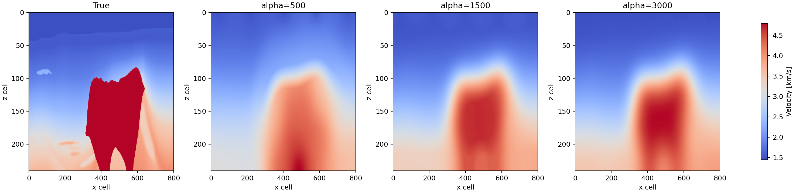
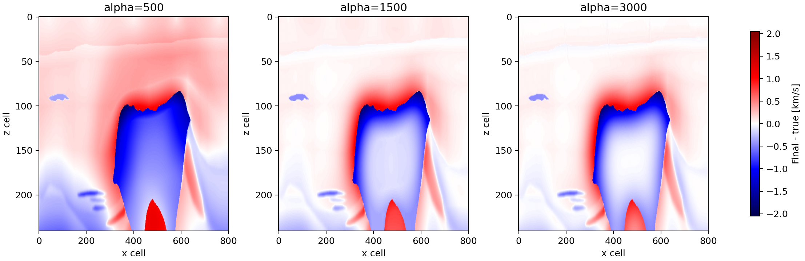
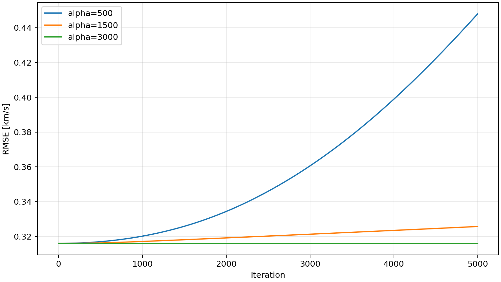
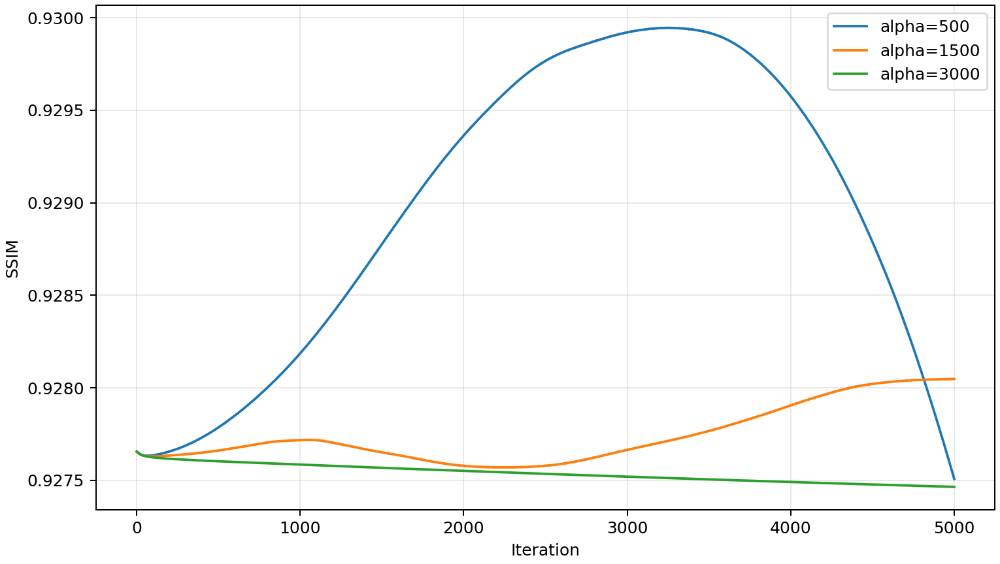
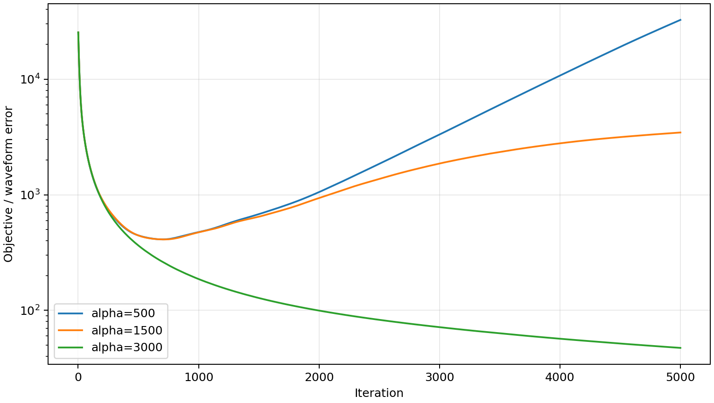
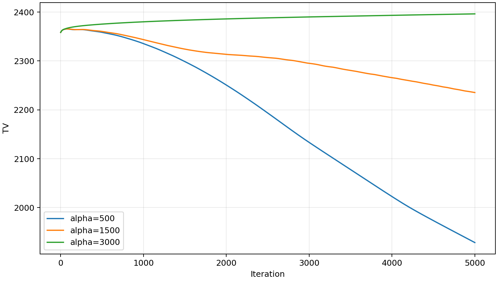

# BP2004 TV + box constrained FWI results

## Summary

BP2004 crop に対して TV + box constraint の PDS 版を `alpha=500,1500,3000` で比較した。全 run は 5000 iteration 完了しており、noise は 0、shot は 5、receiver は 201。速度単位は km/s。

- Model shape: `241 x 801` cells
- Grid spacing: `25.0 m x 25.0 m`
- Box constraint: `1.45 <= v <= 5.5` km/s
- Initial RMSE: `0.316009` km/s
- Initial SSIM: `0.927656`
- True-model TV reference: `3419.636`
- Alpha / true TV: `0.146, 0.439, 0.877` for alpha `500, 1500, 3000`

## Velocity Models

## Final Error Maps

## Metrics Per Iteration

## Final Metrics

| alpha | final RMSE [km/s] | best RMSE [km/s] | final SSIM | best SSIM | final objective | final TV | elapsed |
|---:|---:|---:|---:|---:|---:|---:|---:|
| 500 | 0.447923 | 0.316007 | 0.927508 | 0.929945 | 32519.8 | 1928.578 | 2.22 h |
| 1500 | 0.325739 | 0.316007 | 0.928048 | 0.928048 | 3453.66 | 2235.437 | 2.22 h |
| 3000 | 0.316000 | 0.315999 | 0.927465 | 0.927656 | 47.3755 | 2396.329 | 1.89 h |

## Notes

- `metrics.csv` の `mse` は全セルの二乗誤差和なので、このレポートでは `sqrt(mse / number_of_cells)` として RMSE に変換した。
- `error per iter` は波形残差由来の目的関数 `objective_history` として描画した。
- `alpha=3000` は objective と RMSE が最も低く、最終速度場も true に最も近い。一方で SSIM は `alpha=1500` がわずかに高い。差は小さいため、構造類似度だけを見ると中程度の TV 制約も候補になる。
- `alpha=500` は TV が最も小さく、平滑化が強すぎる。目的関数と RMSE が iteration とともに悪化しており、この設定では制約半径が狭すぎてデータ適合とモデル再構成の両方を阻害している可能性が高い。
- `alpha=1500` は `alpha=500` より安定しているが、後半で objective が増加している。今回の `gamma1=1e-6`, `gamma2=100` では、alpha によっては長時間反復で単調改善しない。
- `alpha=3000` は true model の TV reference に近い制約半径で、TV が過度に圧縮されず、objective も低い水準に収束している。今回の 3 条件では最有力。

## Run Directories

- alpha=500: `results/bp2004/20260603_220518_bp2004_pds_alpha-500_noise-0_box-1p45-5p5`
- alpha=1500: `results/bp2004/20260603_220447_bp2004_pds_alpha-1500_noise-0_box-1p45-5p5`
- alpha=3000: `results/bp2004/20260603_235843_bp2004_pds_alpha-3000_noise-0_box-1p45-5p5`
