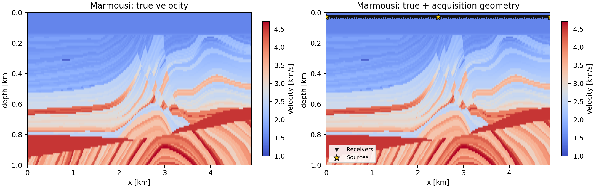
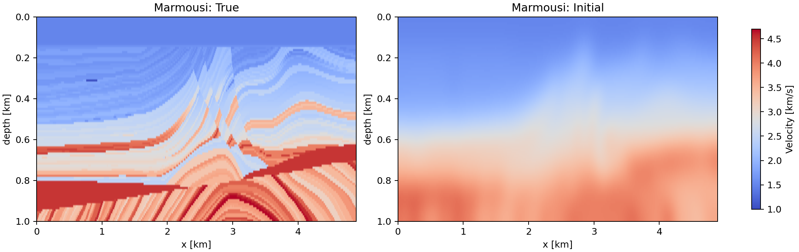
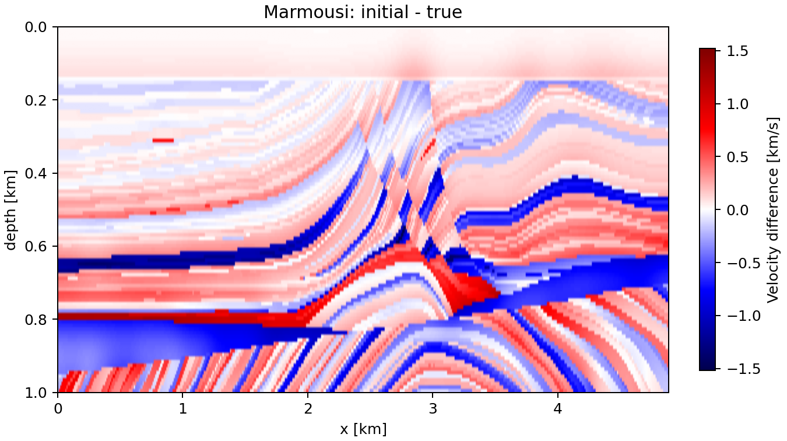

# Marmousi データ考察

## 概要

`src/box-TV-constrained-FWI-marmousi.py` で使う Marmousi データについて、Salt/BP2004 と同じ観点で整理する。ここでの Marmousi は `scripts/prepare_marmousi.py` により、公開 elastic Marmousi model の P-wave velocity を full extent のまま縦 101 cell に縮小したもの。

## 基本データ

| 項目 | 値 |
|---|---:|
| raw VP shape [z, x] | `(2801, 13601)` |
| raw grid spacing | `1.25 m` |
| raw physical size [depth, width] | `3500 m x 17000 m` |
| processed true shape [z, x] | `(101, 490)` |
| aspect-preserving equivalent spacing [z, x] | `35.000 m x 34.765 m` |
| FWI driver spacing [z, x] | `10 m x 10 m` |
| FWI driver physical size [depth, width] | `1000 m x 4890 m` |
| processed cells | `49,490` |
| true velocity range | `1.028 - 4.700 km/s` |
| initial velocity range | `1.511 - 4.159 km/s` |
| box constraint in driver | `1.0 - 4.7 km/s` |
| initial RMSE | `0.377147 km/s` |
| true TV | `8061.381` |
| initial TV | `1245.684` |
| true file | `datasets/marmousi/processed/marmousi_vp_true_full_101x490.npy` |
| initial file | `datasets/marmousi/processed/marmousi_vp_init_full_101x490.npy` |

## Acquisition / FWI 設定

| 項目 | 値 |
|---|---:|
| default shots | `3` |
| default receivers | `101` |
| source x range | `0 - 4890 m` |
| receiver x range | `0 - 4890 m` |
| source spacing | `2445.000 m` |
| receiver spacing | `48.900 m` |
| source depth | `30 m` |
| receiver depth | `30 m` |
| damping cell thickness | `40` |
| simulation time steps | `1000` |
| source frequency | `0.01` |
| source peak time | `100` |
| num_parallels | `4` |

## Salt / BP2004 との位置づけ

| 項目 | Salt | Marmousi | BP2004 |
|---|---:|---:|---:|
| 実験用 shape [z, x] | `50 x 100` | `101 x 490` | `241 x 801` |
| 実験セル数 | `5,000` | `49,490` | `193,041` |
| driver spacing [m] | `10 x 10` | `10 x 10` | `25 x 25` |
| driver size [depth x width] | `0.49 km x 0.99 km` | `1.00 km x 4.89 km` | `6.00 km x 20.00 km` |
| default shots | `20` | `3` | `5` |
| default receivers | `101` | `101` | `201` |
| source/receiver depth | `30 m` | `30 m` | `25 m` |
| velocity range [km/s] | `about 1.4-4.8 after zoom` | `1.028-4.700` | `1.486-4.790` |

## 考察

- Marmousi は Salt より約 9.9 倍セル数が多く、BP2004 よりは約 1/3.9 のセル数。Salt よりは本格的だが、BP2004 より軽い中間的なベンチマークとして使いやすい。
- Marmousi は横長で薄いモデルなので、横方向の反射・層構造の連続性が支配的。Salt のような単一の大きな salt body というより、細かい層構造・褶曲・断層的な不連続をどれだけ保てるかを見るデータ。
- default は 3 shots / 101 receivers なので、BP2004 よりさらに shot 数が少ない。FWI の照明はかなり限られ、深部や端部の再構成は source 配置に強く依存する。
- `prepare_marmousi.py` は raw の物理スケールを保って縦 101 cell に縮小しているが、FWI driver は spacing を `10 m x 10 m` と固定している。raw Marmousi の 1.25 m grid から full extent を縮小したと考えると等価 spacing は約 35 m なので、現在の driver 上の物理サイズは元データより約 3.5 倍小さく扱われている。この点は波動伝播条件、source frequency、走時解釈に効くため、物理スケールを厳密に議論する場合は spacing を見直すべき。
- initial model は Gaussian smoothing sigma=8 pixel で作られており、層境界の細かい構造はかなり消える。一方で全体の低速/高速トレンドは残るため、TV 制約の効果を見るには妥当な初期値。
- box constraint は true の min/max を 0.1 km/s 刻みに丸めた `1.0-4.7 km/s`。Salt より低速域が広く、浅部低速層の再構成が評価に入りやすい。
- TV 制約では、Marmousi の細かい層状構造を過度に平滑化しない alpha 選びが重要。Salt で有効な強めの TV は、Marmousi では層構造を潰す可能性がある。
