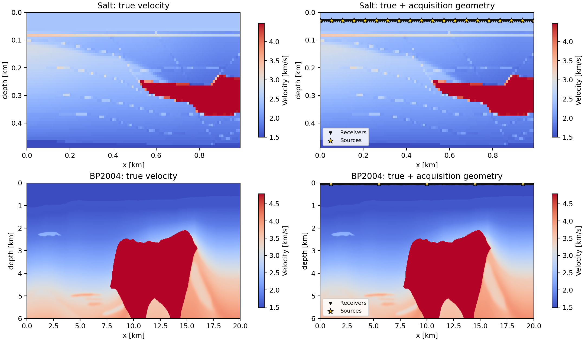
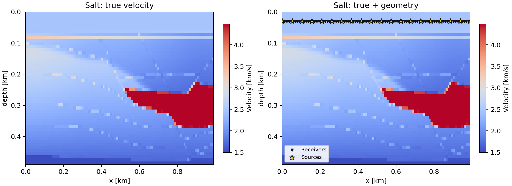
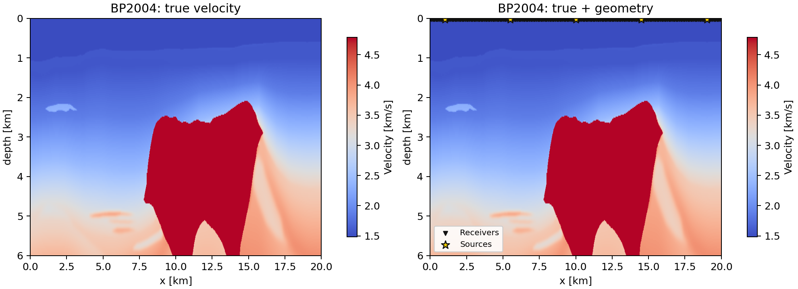

# Salt と BP2004 データ比較

## 概要

このメモは、現在の FWI 実験コードで使っている Salt model と BP2004 model の違いをまとめたもの。ここでの Salt は `src/box-TV-constrained-FWI.py` の標準設定、BP2004 は `src/box-TV-constrained-FWI-BP2004.py` と直近の BP2004 実験設定を基準にしている。

## True 画像と観測配置

## 基本データ

| 項目 | Salt | BP2004 |
|---|---:|---:|
| 元データ shape | `(210, 676, 676)` | `(1911, 5395)` |
| 元データ grid spacing [m] | `20 x 20 x 20` | `6.25 x 12.5` |
| 元データ物理サイズ [m] | `4180 x 13500 x 13500` | `11937.5 x 67425` |
| 実験用 true shape [z, x] | `(50, 100)` | `(241, 801)` |
| 実験用 grid spacing [z, x] [m] | `10 x 10` | `25 x 25` |
| 実験用物理サイズ [depth, width] [m] | `490 x 990` | `6000 x 20000` |
| 実験セル数 | `5,000` | `193,041` |
| true velocity range [km/s] | `1.417 - 4.834` | `1.486 - 4.790` |
| initial velocity range [km/s] | `2.131 - 2.582` | `1.489 - 4.780` |
| box constraint [km/s] | `1.5 - 4.5` | `1.45 - 5.5` |
| initial model | y-index 300 断面を Gaussian smoothing, then zoom/crop | crop 後 true を Gaussian smoothing, sigma z=20, x=40 |

## Acquisition / FWI 設定

| 項目 | Salt | BP2004 |
|---|---:|---:|
| shots | `20` | `5` |
| receivers | `101` | `201` |
| source x range [m] | `0 - 990` | `1000 - 19000` |
| receiver x range [m] | `0 - 990` | `0 - 20000` |
| source spacing [m] | `52.1053` | `4500` |
| receiver spacing [m] | `9.9` | `100` |
| source depth [m] | `30` | `25` |
| receiver depth [m] | `30` | `25` |
| damping cell thickness | `40` | `40` |
| simulation time steps | `1000` | `999` |
| source frequency | `0.01` | `0.005` |
| source peak time | `100` | `100` |

## 特徴と違い

- Salt は元データが 3-D cube で、コードでは y-index 300 の 2-D 断面をかなり小さい `100 x 50` grid に切り出して使う。計算は軽く、アルゴリズム検証やパラメータ探索に向いている。
- Salt の元データは `1.5-4.482 km/s` の範囲だが、実験用断面は `scipy.ndimage.zoom` による補間後の crop なので、true velocity が box constraint の外へ少しオーバーシュートしている。これは Salt 実験の RMSE や box constraint 評価で注意が必要。
- BP2004 は 2-D velocity benchmark の一部を crop/resample しており、実験 grid は `801 x 241`。Salt 実験よりセル数が約 38.6 倍大きく、1 iteration あたりの計算負荷もかなり重い。
- Salt は横幅が約 0.99 km、BP2004 は約 20 km。BP2004 は横方向にかなり広いので、同じ receiver 数でも receiver spacing は Salt より大きい。
- Salt は 20 shots / 101 receivers、BP2004 は 5 shots / 201 receivers。BP2004 は shot 数を抑えつつ、receiver を広域に配置している。
- Salt の source/receiver は端から端まで配置される。BP2004 の source は端から 1 km の margin を置き、receiver は crop 全幅に配置される。
- Salt の速度範囲は典型的な salt body を含む `1.5-4.5 km/s` 付近。BP2004 は最大速度が今回の crop では約 `4.79 km/s` だが、box constraint は余裕を見て `5.5 km/s` まで許している。
- BP2004 は深さ 6 km・横幅 20 km のモデルなので、Salt よりも大域的な構造、照明不足、shot 配置の影響を受けやすい。Salt の小型実験で良い gamma や alpha が、そのまま BP2004 に移るとは限らない。

## Source

- Salt model: `datasets/salt_and_overthrust_models/3-D_Salt_Model/VEL_GRIDS/Saltf@@`
- BP2004 raw: `data/raw/bp2004/vel_z6.25m_x12.5m_exact.segy`
- BP2004 processed: `data/processed/bp2004/bp2004_initial_crop.npz`
- Salt driver: `src/box-TV-constrained-FWI.py`
- BP2004 driver: `src/box-TV-constrained-FWI-BP2004.py`
